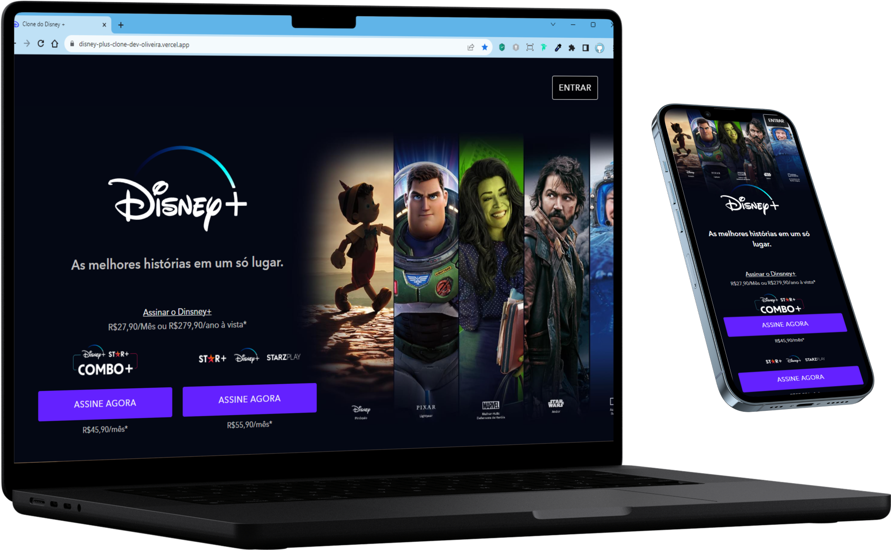

 
<br>
<div align="center">

[Descrição](#--descrição-do-projeto-) |
[Funcionalidades](#%EF%B8%8F-funcionalidades)|
[Como executar esse projeto ?](#%EF%B8%8F-como-executar-esse-projeto-) |
[Deploy](#%EF%B8%8Fdeploy) |
[Referências](#-referências-) |
[Autor](#-autor-) 
</div>
<br>
<div style="display: inline_block">


  </div>

<br>


<div align="center"> 
<h1 text-align="center"> 🌟Disney+ "Clone"🌟</h1> 
</div>
<br>
<br>
<div align='left'>
<h2> ✅ Descrição do Projeto: </h2> 
<div>


<br>
<p align='left' width="400">
   Esse Projeto é um Clone do Site da <a href="https://www.disneyplus.com/pt-br">Disney+</a>, Nesse Projeto utilizei <strong><a href="https://gulpjs.com/">Gulp</a></strong> como principal ferramenta para me auxiliar na construção dessa Landig Page; com o <strong><a href="https://gulpjs.com/">Gulp</a></strong> foi feito a compactação do código JavaScritp e compressão de imagens </p>
<br>
<br>


<div align="center">
<h2> Video 📽️ de Demostração do Projeto</h2>


https://github.com/emmanuelmarcosdeoliveira/disney_plus_clone/assets/116108389/f9de74c9-eb23-4429-a91d-c4f84c41add2


</div>
<br>
<br>

<div align='center'>
  <h2>⚙️ Funcionalidades</h2>
<div>
<p align ="left"> Esse projeto simula o site oficial da <strong><a href="https://www.disneyplus.com/pt-br">Disney+</a></strong>. Onde o usuário poderá fazer a contração de pacotes da <strong>Disney+</strong> e Fazer login e ter acesso ao seu conteúdo.<br>
<br>
<!-- 
 <div align="center">
 <h2>📸 Imagens do Projeto versão web.</h2>
<br>
<br> 
  
> :bulb: **Dica:** Algumas imagens da versão Desktop.

<br>
<br>
 

 
 
   
</div>
<div>
 <h2>📱 Imagens do Projeto verão Mobile.</h2>
<br>
 <br>
 
 > :bulb: **Dica:** Algumas imagens da versão Mobile.

<br>
<br>
 
 
 
 
</div> -->

<div align='center'>
<h2>🪛Tecnologias Utilizadas </h2>
</div>

<div>


</div>

<br>
<br>

</div>

<div align='center'>
 <h2>🛣️ Como Executar esse projeto ?</h2>
</div>
<br>
<br>
<div align="left" width="300"px>

>1-  **Pré Requisitos:**<br> > **Ter instaldo em seu computador: Caso não tenha segue abaixo os link´s para instalação**<br>
 💾 - [node.js](https://nodejs.org/en)<br>
 💾 - [vs-code](https://code.visualstudio.com/)<br>
</div>
<br>
<div align="left">

>2-   **Fazer o __clone do repositório__ deste projeto para o seu computador.**<br>
 Caso não saiba o que é isso; **como fazer um clone de um Repositório no GitHub** vou deixar umn video aqui do [Willian Justen](https://willianjusten.com.br/) com o passo a passo de como fazer o clone de um Repositório do GitHub.
 [Como fazer um clone de um repositório no GitHub](https://www.youtube.com/watch?v=WEPB5pDSEIg) 
</div>
<br>
<div align="left">

>3- **Abra esse projeto dentro do seu [VScode](https://code.visualstudio.com/)**
    <br>
</div>
<br>
<div align="left">

>4-  **Digite o comando dentro do terminal do [VScode](https://code.visualstudio.com/)**
<i>Esse comando faz uma verificação de todas as Dependências necessária para a execução do projeto e faz a instalação dessas dependências para que você possa executar esse projeto.Espere o processo ser concluido.</i>
     
```bash
 npm install
```
</div>
<br>
<div align="left">

>5- **Agora digite o comando para a _execução do Gulp_ dentro do terminal do [VScode](https://code.visualstudio.com/)** 
</h2>

```bash
npm run dev
```

</div>
<br>

<div align="left">

>6-  Pronto🏅
 **Vocé já tem o projeto dentro do seu github; podendo verificar o código; fazer alterações. etc...**

</div>

<br>
<h2>🗺️Deploy</h2>

**Para ter Acesso ao Projeto; clique no link Abaixo:**
<br>
<br>
[](https://disney-plus-clone-dev-oliveira.vercel.app/)
 

<br>

<div align='center'>
<h2> 📚Referências </h2>
 </div>
<div align="center">

 :memo: **Acesse:** [EBAC](https://ebaconline.com.br/)
<br>
<br>

</div>
<div align='center'>
 <h2>👨🏻‍🦱 Autor </h2>
<h3> <a href="https://oliveira-portifolio.vercel.app/">Dev-Oliveira</a> </h3>
   <a href ="https://wa.me/5511968336094"></a>
  <a href = "mailto:emmanuelmarcosdeoliveira@gmail.com"></a>
   <a href="https://www.linkedin.com/in/oliveira-marcos-emmanuel?lipi=urn%3Ali%3Apage%3Ad_flagship3_profile_view_base_contact_details%3BUetG4s3ZT76Byt3XWdZ2Tg%3D%3D" target="_blank"></a>

<br>
<br>  
&copy; Todos os Direitos Reservados

<h1> 😁Obrigado por chegar até aqui!</h1>
</div>
